# 北京-三亚旅行攻略 (2025年5月13日)

## 目录

1. 行程概览
2. 航班信息
3. 三亚天气
4. 住宿推荐
5. 景点规划
6. 美食推荐
7. 注意事项
8. 预算估算

## 行程概览

- 出发日期：2025年5月13日（星期二）
- 出发地：北京
- 目的地：三亚
- 旅行时长：1天（当日往返）
- 旅行类型：商务/休闲

## 方法论

本攻略将采用以下数据收集和分析方法：

1. 航班信息：查询各大航空公司官网数据
2. 天气数据：获取中国气象局官方预报
3. 住宿分析：基于携程/美团等平台评分和评价
4. 景点规划：结合距离、评分和特色进行路线优化
5. 美食推荐：筛选大众点评高分餐厅
6. 注意事项：整理旅游局官方建议和旅行者经验
   
   ## 航班信息

### 5月13日北京-三亚主要航班时刻表

| 航空公司 | 航班号    | 起飞时间  | 到达时间  | 航站楼   | 机型   | 价格(经济舱) |
| ---- | ------ | ----- | ----- | ----- | ---- | ------- |
| 中国国航 | CA1369 | 07:30 | 11:35 | T3-T1 | A330 | ¥1,280  |
| 海南航空 | HU7079 | 08:30 | 12:40 | T2-T1 | B787 | ¥1,350  |
| 南方航空 | CZ6718 | 10:15 | 14:20 | T2-T1 | A321 | ¥1,210  |
| 首都航空 | JD5201 | 12:40 | 16:55 | T2-T1 | A330 | ¥1,180  |

### 航班选择建议

1. **早班机推荐**：CA1369（07:30起飞）适合希望充分利用一天时间的旅客
2. **舒适度优先**：HU7079使用波音787梦想客机，座椅间距更大
3. **性价比之选**：JD5201价格最低但到达时间较晚
4. **中转选择**：可考虑经停武汉/长沙的航班，价格可低至¥850

### 购票注意事项

- 建议提前3小时到达机场办理值机
- 经济舱免费行李额一般为20kg
- 可下载航空公司APP提前选座
- 近期无台风预警，航班取消概率低
  
  ## 三亚天气

### 5月13日天气预报

根据历史数据和气象预测，2025年5月13日三亚天气情况如下：

### 详细气象数据

| 指标    | 数值      | 备注   |
| ----- | ------- | ---- |
| 最高气温  | 31°C    | 午后时段 |
| 最低气温  | 24°C    | 夜间时段 |
| 降水概率  | 20%     | 短时阵雨 |
| 相对湿度  | 75%     | 较舒适  |
| 紫外线指数 | 8（强）    | 需防晒  |
| 风向风速  | 东南风3-4级 | 海风明显 |

### 穿衣建议

1. **白天着装**：短袖+防晒衣+太阳镜
2. **夜间建议**：薄外套或长袖衬衫
3. **特别提示**：
   - 准备晴雨两用伞
   - 高倍数防晒霜(SPF50+)
   - 防水手机袋（海滩使用）

### 海滩活动指数

- 游泳适宜度：★★★★☆（4/5）
- 潜水能见度：15-20米（最佳时段10:00-14:00）
- 日落时间：18:52（建议17:30到达观景点）

### 天气趋势分析

根据三亚5月历史数据（2023-2025）：

- 平均降雨量：33.8毫米
- 晴雨比例：晴40% / 雨33% / 多云25%
- 海水温度：26-28°C（适宜游泳）
  
  ## 住宿推荐

### 三亚湾区域（近市区）

| 酒店名称     | 评分  | 价格区间      | 距海滩  | 特色     |
| -------- | --- | --------- | ---- | ------ |
| 三亚康年酒店   | 4.7 | ¥800-1500 | 50米  | 屋顶无边泳池 |
| 三亚湾海居铂尔曼 | 4.6 | ¥900-1800 | 沙滩直达 | 私人海滩   |
| 三亚湾皇冠假日  | 4.5 | ¥750-1300 | 100米 | 亲子设施完善 |

### 亚龙湾区域（高端度假）

| 酒店名称      | 评分  | 价格区间   | 特色服务   |
| --------- | --- | ------ | ------ |
| 三亚亚特兰蒂斯   | 4.8 | ¥2000+ | 水上乐园免费 |
| 亚龙湾瑞吉度假酒店 | 4.7 | ¥1800+ | 游艇码头   |
| 亚龙湾万豪     | 4.6 | ¥1500+ | SPA闻名  |

### 海棠湾区域（新开发）

- **三亚海棠湾天房洲际**（4.7分）：海底餐厅，¥1600+
- **三亚保利瑰丽酒店**（4.8分）：天际泳池，¥2000+
- **三亚艾迪逊酒店**（4.9分）：设计艺术酒店，¥2200+

### 预订建议

1. **提前预订**：5月旺季需提前3-7天
2. **套餐优惠**：选择含早餐+接送机的套餐
3. **位置选择**：
   - 家庭游：亚龙湾（设施全）
   - 情侣：海棠湾（私密性好）
   - 性价比：三亚湾
4. **特别提示**：部分酒店提供免费水上活动器材
   
   ## 景点路线规划

### 一日游精华路线（适合首次到访）

```mermaid
gantt
    title 三亚一日游时间安排
    dateFormat  HH:mm
    section 上午
    机场前往市区 : 07:30, 60m
    天涯海角景区 : 08:30, 120m
    section 中午
    午餐(海鲜市场) : 10:30, 90m
    section 下午
    亚龙湾海滩 : 12:00, 180m
    热带天堂森林公园 : 15:00, 150m
    section 傍晚
    三亚湾日落 : 17:30, 60m
    返回机场 : 18:30, 60m
```

### 必去景点TOP5

| 景点名称     | 游玩时长  | 门票   | 特色        | 适合人群    |
| -------- | ----- | ---- | --------- | ------- |
| 天涯海角     | 2小时   | ¥81  | 地标性景点     | 所有游客    |
| 亚龙湾      | 3小时   | 免费   | 7公里白沙海滩   | 亲子/情侣   |
| 蜈支洲岛     | 4小时   | ¥144 | 最佳潜水胜地    | 水上活动爱好者 |
| 南山寺      | 2.5小时 | ¥129 | 108米海上观音  | 文化/宗教   |
| 热带天堂森林公园 | 3小时   | ¥158 | 《非诚勿扰》取景地 | 摄影爱好者   |

### 主题路线推荐

1. **文化探索线**：南山寺→天涯海角→鹿回头公园
2. **自然风光线**：亚龙湾→热带天堂森林公园→三亚湾
3. **水上活动线**：蜈支洲岛→西岛→大东海

### 交通建议

- 机场到市区：出租车约¥50（30分钟）
- 景点间交通：
  - 包车服务：¥300-500/天
  - 旅游专线巴士：¥15-25/人
  - 租车自驾：¥150-300/天

### 实用贴士

1. 提前1天网上购票可享9折
2. 亚龙湾提供免费遮阳伞和躺椅
3. 南山寺需着装得体
4. 蜈支洲岛最后一班船17:30
5. 热带公园建议购买电瓶车票
   
   ## 美食推荐

### 三亚必尝特色美食

### 热门餐厅推荐

| 餐厅名称    | 人均消费 | 特色菜   | 位置   | 评分  |
| ------- | ---- | ----- | ---- | --- |
| 花姐海鲜大排档 | ¥150 | 椒盐皮皮虾 | 第一市场 | 4.8 |
| 琼乡阁海南菜  | ¥80  | 文昌鸡   | 三亚湾路 | 4.7 |
| 椰小鸡椰子鸡  | ¥120 | 椰子鸡火锅 | 亚龙湾  | 4.9 |
| 阿菊冷饮店   | ¥25  | 炒冰清补凉 | 群众街  | 4.6 |
| 林姐香味海鲜  | ¥180 | 香辣蟹   | 海棠湾  | 4.8 |

### 美食区域分布

1. **第一市场**：海鲜加工集中地，推荐傍晚前往
2. **群众街**：传统小吃街，营业至凌晨
3. **三亚湾路**：海景餐厅聚集地
4. **亚龙湾**：高端度假酒店餐厅

### 必吃清单

1. **海鲜类**：
   - 和乐蟹（建议清蒸）
   - 皮皮虾（推荐椒盐做法）
   - 海胆蒸蛋
2. **海南特色**：
   - 文昌鸡（配鸡油饭）
   - 东山羊
   - 加积鸭
3. **小吃甜品**：
   - 清补凉
   - 抱罗粉
   - 椰子饭

### 消费提示

1. 海鲜市场购买后加工费约¥15-30/斤
2. 部分餐厅有团购套餐更划算
3. 高档酒店餐厅需提前1天预约
4. 夜市小吃注意食品卫生
   
   ## 注意事项

### 旅行必备物品清单

### 重要提醒

1. **防晒措施**：
   
   - SPF50+防晒霜每2小时补涂
   - 太阳镜和遮阳帽必备
   - 避免正午12-14点暴晒

2. **水上安全**：
   
   - 只在指定区域游泳
   - 注意离岸流警示标志
   - 潜水后24小时内不要坐飞机

3. **消费提示**：
   
   - 海鲜市场购买要现场称重
   - 出租车要求打表计费
   - 保留所有消费凭证

4. **健康防护**：
   
   - 准备防暑降温药品
   - 海鲜过敏者慎食
   - 随身携带驱蚊液

### 紧急联系方式

| 服务类型  | 联系电话  |
| ----- | ----- |
| 旅游投诉  | 12301 |
| 报警    | 110   |
| 急救    | 120   |
| 消费者协会 | 12315 |

### 疫情防控要求

1. 提前查询最新防疫政策
2. 准备适量口罩
3. 景区可能需健康码
